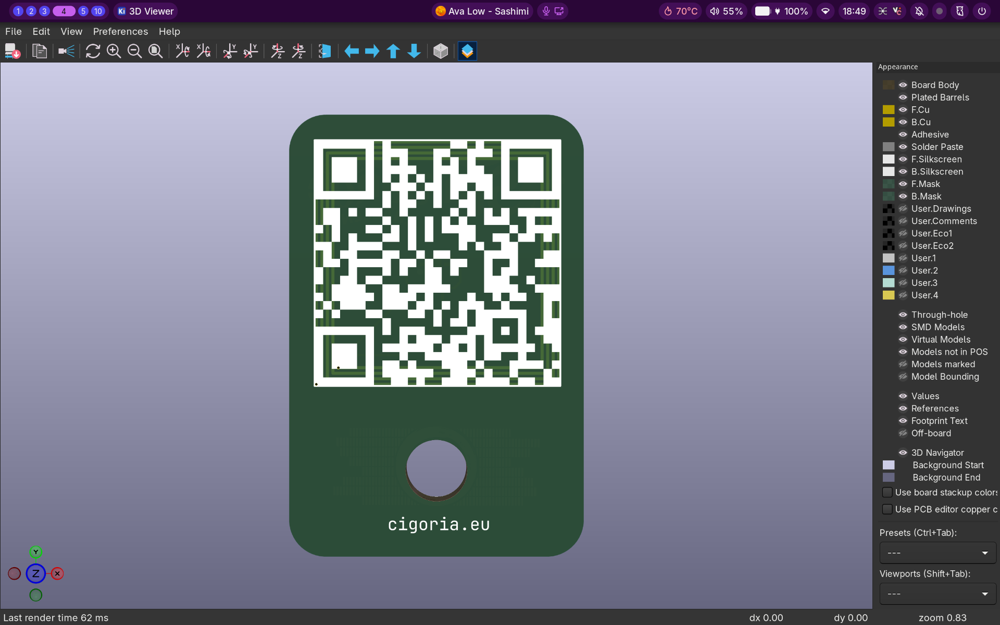
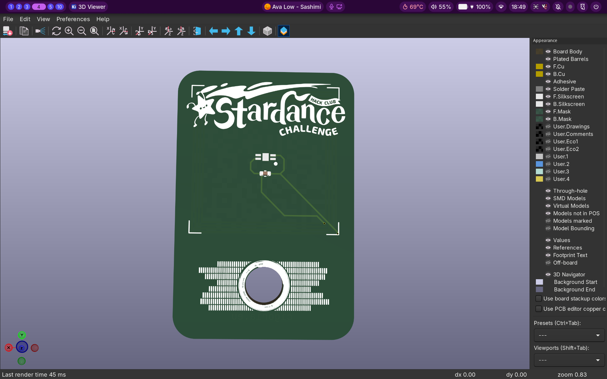
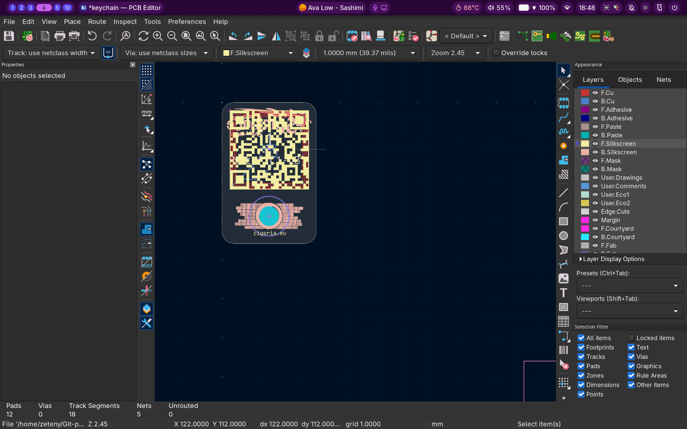
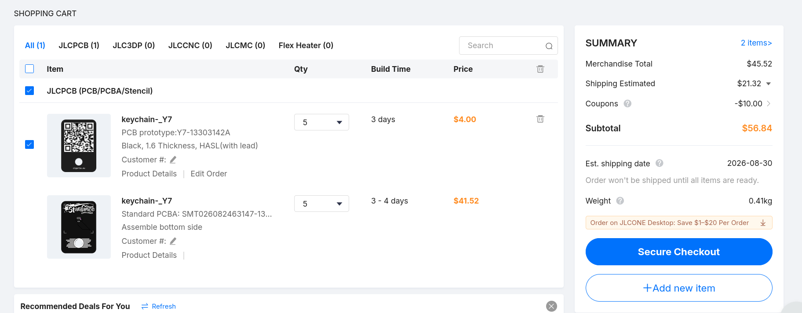

# Keychain NFC Project

This is a KiCad-based NFC keychain project using the NXP NT2H1311F0DTLH NFC Forum Type 2 Tag compliant IC.

## Overview

The project features a compact, printed circuit board (PCB) based NFC keychain with 144 bytes of user memory and field detection capabilities.

### 3D Renders

### PCB Design

## Features

- **NFC Chip**: NXP NT2H1311F0DTLH
- **NFC Type**: NFC Forum Type 2 Tag compliant
- **Memory**: 144 bytes user memory
- **Antenna**: Integrated loop antenna
- **PCB**: Black, 1.6mm thickness, HASL (with lead) surface finish
- **Size**: Compact keychain-sized design

## Components

### Main components

- **IC1**: NT2H1311F0DTLH - NFC Tag IC (NXP)
- **C1**: Capacitor (Optional)
- **AE1**: NFC antenna (loop antenna)
- **H1**: Keychain hole (5mm)

## Files

- `keychain.kicad_pro` - KiCad project file
- `keychain.kicad_sch` - Schematic
- `keychain.kicad_pcb` - PCB layout
- `images/` - 3D renders and design images
- `production/` - Manufacturing files (BOM, positions, etc.)

## Price List

### Manufacturing costs (JLCPCB)

| Item | Description | Quantity | Lead time | Price |
|------|-------------|----------|-----------|-------|
| PCB prototype | Y7-13303142A, Black, 1.6mm thickness, HASL (with lead) | 5 pcs | 3 days | $4.00 |
| PCBA assembly | SMT026082463147-13303142A, Bottom side assembly | 5 pcs | 3-4 days | $41.52 |

### Summary

- **Merchandise Total**: $45.52
- **Shipping Estimated**: $21.32
- **Coupons**: -$10.00
- **Subtotal**: $56.84
- **Weight**: 0.41kg
- **Est. shipping date**: 2026-08-30

## Manufacturing

The project is optimized for JLCPCB. Manufacturing files are located in the `production/` folder:

- `keychain.zip` - Complete manufacturing package
- `bom.csv` - Bill of materials
- `positions.csv` - Component positions
- `designators.csv` - Component designators
- `netlist.ipc` - Netlist

## NFC Functionality

The NT2H1311F0DTLH chip supports:

- NFC Forum Type 2 Tag standard
- 144 bytes user memory
- Field detection
- Passive operation (no battery required)

## License

See the [LICENSE](LICENSE) file for license details.

## Author

- Created by: Zeti_1223
